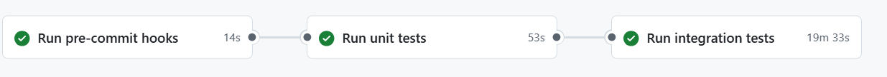
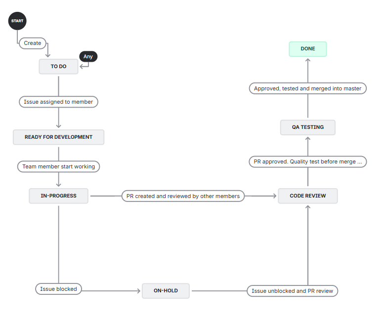
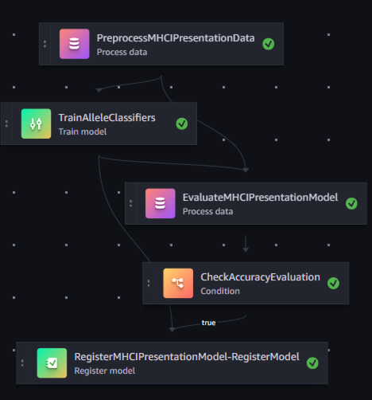

## Layout of the project repository


```
├── codebuild-buildspec.yml      # Definition used by AWS CodeBuild to run CI jobs
├── CONTRIBUTING.md              # Contribution guidelines for collaborators
├── data_analysis/               # Utilities and cleaning scripts for exploratory analysis
├── developer.md                 # Developer-focused setup and workflow notes
├── img/                         # Images referenced in documentation and presentations
├── pipelines/                   # Pipeline package and entry points
│   ├── InstaDeepMHCIPresentation/
│   │   ├── evaluate.py          # Model evaluation step definition
│   │   ├── pipeline.py          # Orchestrates the full SageMaker pipeline
│   │   ├── preprocess.py        # Data preprocessing logic used by the pipeline
│   │   └── __init__.py
│   ├── __init__.py
│   ├── __version__.py
│   ├── _utils.py
│   ├── get_pipeline_definition.py
│   ├── run_pipeline.py
│   └── train.py
├── requirements.txt             # Python dependencies for local development and testing
├── sagemaker-pipelines-project.ipynb  # Notebook describing the SageMaker project setup
├── setup.cfg                    # Package metadata and configuration for tooling
├── setup.py                     # Package installation entry point
├── tests/
│   └── test_pipelines.py        # Unit tests for the pipeline package
├── tox.ini                      # Tox environments for running tests and linters
└── training_notebook/           # Assets for the interactive model training notebook
    ├── full_training.ipynb
    ├── clean/
    ├── models/
    └── outputs/
```

# MHCI Presentation Project

##  Getting Started
 
This guide will help you set up your environment and contribute effectively to the **MHCI Presentation** repository.  
Please follow the steps carefully to prepare your environment and align with our software and project management best practices.

---

## 🧩 Software Best Practices

Following CI/CD are implemented;

1- Lint Code (Checking th code quality)

2- Unit test

3- Integration test: Whenever a change maded to branch, AWS Sagemaker pipeline runs at back end. If pipeline succesfull, the PR is allowed to merge into master. Please see example in the picture;





### 1️⃣ Create a New Environment
```powershell
python -m venv myenv
```

### 2️⃣ Activate the Environment
```powershell
.\myenv\Scripts\Activate
pip install -r requirements.txt
```

### 3️⃣ Pre-Commit Setup
We use **pre-commit hooks** to automatically check code quality before each commit.  
The configuration is defined in `.pre-commit-config.yaml`.

#### Installation
```bash
pip install pre-commit
```

If `pre-commit` is not executable from your terminal, update your PATH:
```bash
echo "export PATH=\$PATH:~/.local/bin/" >> ~/.bashrc
source ~/.bashrc
which pre-commit
```

#### Setup Hooks
Run the following to activate the pre-commit hooks:
```bash
pre-commit install
```

The hooks will now run automatically on every commit.  
To test them manually, run:
```bash
pre-commit run --all-files
```

---

## 🗂 Project Management Best Practices

We use **Jira** as our Agile project management environment to track issues and progress.

### 📊 Project Workflow

| Status | Description |
|--------|--------------|
| 📝 **To Do** | Create a new ticket. |
| ⚙️ **Ready for Development** | Assign a team member to the ticket. |
| 🚧 **In Progress** | Assigned member starts development. |
| ⏸️ **On Hold** | Developer is blocked; project manager may reassign. |
| 🔍 **Code Review** | Developer submits a PR; reviewers request and verify changes. |
| 🧪 **QA Test** | Developer performs required tests post-review. |
| ✅ **Done** | All tests pass, and the PR is merged into `master`. |

---

Project cycle is shown in Figure



### 🔄 How to Contribute

1. **Create an Issue**  
   Log a new issue in Jira and assign it to the responsible person.

   

2. **Create a Branch**  
   - In Jira, open the ticket and click **“Create Branch.”**  
   - Select the repository and confirm.

   

3. **Start Development**
   ```bash
   git checkout <branch-name>
   ```
   Begin developing according to the project workflow above.

4. **Pull Request & Review**
   - The `master` branch is **protected** — direct pushes are **not allowed**.  
   - To merge, create a **Pull Request (PR)**.  
   - At least **two approvals** from team members are required before merging into `master`.

---


# 📘 Clinical Biomarker Analysis (Drug vs Placebo Study)

This section documents the full workflow performed on the `clinical.csv` dataset to analyse biomarker modulation across time and to build a machine-learning model predicting the treatment regimen based on important biomarkers.

---

## 1️⃣ Dataset Overview

The dataset contains:

- **USUBJID** — subject identifier  
- **TREATMENT** — DRUG or PLACEBO  
- **VISIT** — D0 (baseline), D1 (24 hours), D2 (48 hours)  
- **GENDER**  
- **Biomarkers** — all columns prefixed with `MARKER_`

According to the clinical protocol:

- D1 corresponds to the **Cmax** of the drug  
- D2 corresponds to the **peak physiological effect**, where effector T-cell expansion is observed  

---

## 2️⃣ Descriptive Statistics

We generated summary statistics for:

- Treatment distribution  
- Gender distribution  
- Biomarker **MARKER_TP53**  

These provide an overview of cohort balance and biomarker variability.

---

## 3️⃣ Missing Data Quality Control

The multiplex assay considers any missing biomarker at a visit as a QC failure.

Steps performed:

1. Flagged rows where **any biomarker** was missing  
2. Summarised missingness by **TREATMENT** and **GENDER**  
3. Removed all QC-failed measurements  
4. Created a clean **analysis dataset** with complete biomarker panels  

This ensures that all downstream statistical and ML analyses rely on fully observed data.

---

## 4️⃣ Differential Biomarker Analysis at D2

To identify biomarkers modulated by treatment at D2:

1. Extracted **only D2** measurements  
2. Performed **Welch’s t-test** comparing DRUG vs PLACEBO  
3. Applied **Benjamini–Hochberg FDR correction**  
4. Selected biomarkers with **FDR ≤ 1%**

These biomarkers represent the strongest biological drug-response signatures at 48 hours.

---

## 5️⃣ Time-Course Visualization (D0 → D1 → D2)

For each significant biomarker (FDR ≤ 1%), we plotted:

- Mean biomarker levels at D0, D1, D2  
- Separate lines for DRUG vs PLACEBO  
- Significance annotation where p ≤ 0.01  

Typical behaviour:

- Minimal difference at baseline (D0)  
- Moderate modulation at D1 (around drug Cmax)  
- **Strong increase at D2 in the DRUG arm**, consistent with immune activation  

---

## 6️⃣ Machine Learning Model (Predict Treatment Regimen)

We trained a classifier using **only the significant biomarkers at D2**.

### 🔧 Pipeline
- Median imputation  
- Standard scaling  
- Logistic Regression  
- 70/30 stratified train-test split  

### 📊 Evaluation Metrics
- **Accuracy**  
- **ROC AUC**  
- **Confusion matrix**  
- **Classification report**  
- **ROC curve**  
- **Calibration curve**

### ⭐ Key Finding
The model achieves:

- **ROC AUC ≈ 1.00**  
- Near-perfect separation between DRUG and PLACEBO  

This occurs because the drug induces large, consistent biomarker shifts at D2, which the model captures easily.

---

## 7️⃣ Biological Interpretation

### 🔬 Biomarker Modulation
The significant D2 biomarkers belong to pathways involved in:

- T-cell activation  
- Immune signalling  
- Transcription factors (e.g., NF-κB, TP53 families)

This aligns with the expected pharmacodynamic activity and clinical observation of **effector T-cell expansion at 48h**.

### 🤖 ML Interpretation
The model learns the **drug-induced transcriptional fingerprint**, such that:

- High marker expression → predicts **DRUG**  
- Low marker expression → predicts **PLACEBO**

This confirms the biological relevance of the identified biomarkers.

---

## 8️⃣ Example: Using the Trained Model

```python
new_sample = pd.DataFrame({
    "MARKER_A": [5.7],
    "MARKER_B": [8.2],
    "MARKER_C": [4.9],
})[important_markers]

pred = pipe.predict(new_sample)[0]
proba = pipe.predict_proba(new_sample)[0, 1]

print("Predicted regimen:", "DRUG" if pred == 1 else "PLACEBO")
print("Probability (DRUG):", proba)

</details>


<details>

<summary><b>☁️ AWS SageMaker End-to-End Pipeline (click to expand)</b></summary>

An **end-to-end ML pipeline** was developed to automate the full workflow — from preprocessing to model registration.

### Pipeline Components

| Script | Description |
|--------|--------------|
| `pipeline.py` | Orchestrates the entire MLOps workflow (preprocessing → training → evaluation → registration). |
| `preprocess.py` | Loads and preprocesses data from S3. |
| `train.py` | Trains allele-specific models and saves them to S3. |
| `evaluate.py` | Evaluates models using the test set. |
| **Model Registration** | Registers models for deployment after manual approval. |

✅ The pipeline runs successfully end-to-end, ensuring **reproducibility**, **traceability**, and **automation**.



</details>

